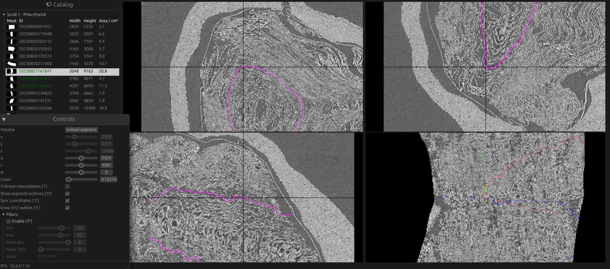

# Vesuvius Volume Browser

A simple browser built with Rust and [egui](https://github.com/emilk/egui) to browse volume data from the [Vesuvius Challenge](https://scrollprize.org/data) data set.



It does not require to download any data upfront.

All the published volumes published so far are supported:

- Scroll 1
- Scroll 2
- Scroll 0332
- Scroll 1667
- Fragments 1 - 4 (from the Kaggle competition)
- Fragment PHerc0051Cr04Fr08
- Fragment PHerc1667Cr01Fr03

Known surface segments are shown in the catalog and can be rendered on a 4th pane.

## Features

- Access to the full volume data set, data is converted to a more efficient format by a background server
- A catalog of known surface segments will allow on-the-fly downloading of surfaces meshes and live rendering
- Rendering options for volumes:
  - thresholding
  - bit depth reduction
  - showing different bit planes
- Rendering options for surfaces:
  - trilinear interpolation
  - show surface outline on the volume panes
  - show xyz outline on the surface pane
  - synchronized panning and zooming between the panes

## Installation

Grab a binary from [the latest release](https://github.com/jrudolph/vesuvius-gui/releases).

## Usage

Install required X11 libraries:

- Ubuntu: `apt install -y libgl1 libxrandr2 libxi6 libxcursor1`
- MacOSX: Should work out of the box
- Windows: Should work out of the box

### Simple browsing:

```
./vesuvius-gui
```

When run without any arguments, the app will download the volume data from the tiles server and cache them in a local directory (below the OS-specific cache directory).

### Specifying a data directory:

Run the app with `./vesuvius-gui <optional-path-to-ppm> <optional-path-to-data-directory>`.

If you pass a path to a ppm file, the app will use that to calculate a surface volume on the fly from the data in the ppm file. This is currently limited to Scroll 1 automatically.

Alternatively, you can provide a path to a directory containing volume grid files of the format `cell_yxz_`. In that case, the app will
only show local data without attempting to download from the blocks server.

To run directly from sources run `cargo run --release -- <optional-path-to-ppm> <optional-path-to-data-directory>`.

Proper argument parsing is planned for the next release.

## Data License

Accessing the data on https://vesuvius.virtual-void.net/ or through this app requires you to fill out the official
form and agree to the terms of the data license. See https://scrollprize.org/data.

## License

Code released under the MPL 2.0. See [LICENSE](LICENSE) for the full license text.
